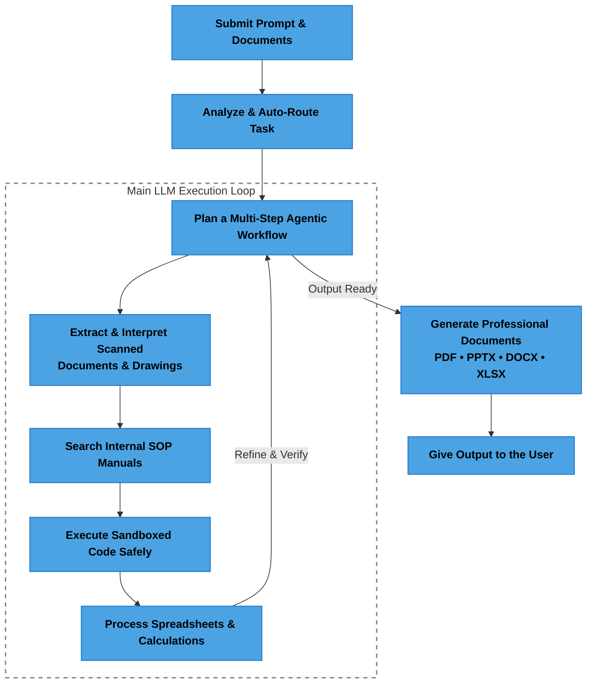

# Sovereign Industrial AI Workbench

An on-premise, air-gapped AI workbench for confidential industrial knowledge work, built for Smart India Hackathon problem statement **SIH26117** for Mangalore Refinery and Petrochemicals Limited (MRPL).

This repository extends Open WebUI with local model routing, agent tools, knowledge-base retrieval, multimodal document workflows, and sandboxed code execution. It is intended for a demonstrable local deployment on a workstation or server, not as a cloud service.

## What It Does

The workbench gives an industrial user one local interface to:

- Chat with multiple open-weight models served by Ollama.
- Automatically route coding, reasoning, policy, and vision requests to suitable local models.
- Ground answers in local manuals, SOPs, reports, and correspondence using ChromaDB and hybrid retrieval.
- Read local files and use agent tools for multi-step tasks.
- Upload images and documents for local vision and OCR processing.
- Run generated Python in the in-browser Pyodide sandbox, with an optional local Jupyter gateway.
- Produce useful work products such as calculation results, notes, and exported transcripts.

The target workflow is an inspection or engineering request that moves from document understanding to grounded analysis, calculation, and an approval-ready deliverable without sending confidential data to a public AI service.

## Architecture



By default, inference, embeddings, retrieval, uploaded files, and application data remain on the local machine. An air-gapped deployment must still be verified with network observation or physical network isolation; environment variables alone are not proof of zero egress.

## Recommended Local Models

The exact model set depends on available memory and the demonstration being run. The current macOS setup uses:

| Model | Role |
| --- | --- |
| `qwen3.5:9b` | General reasoning, coding, and analysis |
| `deepseek-r1:8b` | Deep reasoning and policy or approval drafting |
| `qwen2.5-coder:7b` | Coding and engineering calculations |
| `llava:7b` | Local image and drawing understanding |
| `nomic-embed-text` | Local knowledge-base embeddings |

Pull only the models needed for the available hardware. A 9B model requires several gigabytes of storage and memory; smaller models are suitable for constrained demonstrations.

## macOS Setup

The commands below assume this repository is already checked out at `~/Projects/localAI/LocalAI-SIH`. For the complete platform guide, see [SIH_docs/setup_macos.md](SIH_docs/setup_macos.md).

### Prerequisites

- macOS with at least 16 GB RAM; 32 GB or more is recommended for several models.
- Python 3.11 or 3.12. The project declares Python `>=3.11` and `<3.13`.
- Node.js 18 or newer. Node 20 LTS is recommended.
- Ollama for macOS.
- Docker Desktop is optional and is useful for isolated services.

### Install models

Start Ollama, then pull the local models required for the demonstration:

```bash
ollama serve
ollama pull qwen3.5:9b
ollama pull deepseek-r1:8b
ollama pull qwen2.5-coder:7b
ollama pull llava:7b
ollama pull nomic-embed-text
ollama list
```

The Ollama API should respond locally:

```bash
curl http://127.0.0.1:11434/api/tags
```

### Backend

```bash
cd ~/Projects/localAI/LocalAI-SIH/backend
python3.11 -m venv .venv
source .venv/bin/activate
python -m pip install --upgrade pip
python -m pip install -r requirements.txt
```

Create or review the project-root `.env` file. Do not commit it:

```dotenv
OLLAMA_BASE_URL=http://127.0.0.1:11434
RAG_EMBEDDING_ENGINE=ollama
RAG_EMBEDDING_MODEL=nomic-embed-text
RAG_OLLAMA_BASE_URL=http://127.0.0.1:11434
VECTOR_DB=chroma
WEBUI_AUTH=true
WEBUI_SECRET_KEY=replace-with-a-local-secret
DO_NOT_TRACK=true
SCARF_NO_ANALYTICS=true
ANONYMIZED_TELEMETRY=false
ENABLE_COMMUNITY_SHARING=false
ENABLE_VERSION_CHECK=false
HF_HUB_OFFLINE=1
ENABLE_WEB_SEARCH=false
WEB_SEARCH_ENGINE=none
CODE_EXECUTION_ENGINE=pyodide
```

Start the backend from the `backend` directory so Python resolves the `open_webui` package:

```bash
cd ~/Projects/localAI/LocalAI-SIH/backend
source .venv/bin/activate
python -m uvicorn open_webui.main:app --host 127.0.0.1 --port 8080 --reload
```

### Frontend

In a second terminal:

```bash
cd ~/Projects/localAI/LocalAI-SIH
npm install
npm run dev
```

Open the URL printed by Vite, normally `http://localhost:5173`. The backend API is normally available at `http://localhost:8080`.

### Optional Jupyter sandbox

Pyodide is the default browser sandbox. To test server-side local execution instead:

```bash
cd ~/Projects/localAI/LocalAI-SIH/backend
source .venv/bin/activate
python -m pip install jupyter jupyter-kernel-gateway
jupyter kernelgateway --KernelGatewayApp.ip=127.0.0.1 --KernelGatewayApp.port=8888 --KernelGatewayApp.allow_origin='*'
```

Then select the Jupyter execution engine and set its URL to `http://127.0.0.1:8888` in the administrator settings.

## First Verification Checklist

1. Confirm `ollama list` shows the intended local models.
2. Create the first local user; the first account becomes the administrator.
3. Confirm a chat request reaches an Ollama model.
4. Submit a coding prompt and a policy or reasoning prompt; verify the routing badge changes appropriately.
5. Create a Knowledge Base and upload a local PDF or text document.
6. Retrieve it with `#KnowledgeBaseName` and confirm the answer is grounded in the document.
7. Run a small Python calculation in the Pyodide sandbox.
8. Record local socket or firewall evidence before claiming air-gapped operation.

## Demonstration Scenarios

The intended SIH demonstration sequence is:

1. **Model selection:** route coding and vision or reasoning requests to different local models.
2. **Industrial workflow:** ingest an inspection report, extract findings, ground them against local procedures, and produce an approval note.
3. **Sandboxed coding:** generate and execute an engineering calculation, then show its intermediate steps and verification.
4. **Multimodal analysis:** inspect a scanned report, handwritten note, P&ID, or plant photograph with local OCR and vision.
5. **Sovereignty proof:** run the workflow while showing that connections remain local, or repeat it with network adapters disabled.

The second, third, fourth, and fifth scenarios currently require additional implementation or validation described in [SIH_docs/task.md](SIH_docs/task.md).

## Repository Guide

| Path | Purpose |
| --- | --- |
| `backend/open_webui/` | FastAPI backend, retrieval, routing, tools, and application services |
| `src/` | Svelte frontend |
| `backend/data/` | Local database, uploads, cache, and vector data |
| `SIH_docs/problem_statement.md` | MRPL problem statement and evaluation requirements |
| `SIH_docs/task.md` | Implementation tracker and demonstration checklist |
| `SIH_docs/setup_macos.md` | Detailed macOS setup guide |
| `SIH_docs/setup.md` | Windows and Linux setup guide |
| `SIH_docs/docling_setup.md` | Optional Docling OCR service setup |

## Security and Scope

This project is designed for local, confidential workloads, but a local deployment is not automatically air-gapped. Disable unused integrations, use local model and embedding endpoints, inspect outbound connections, and physically isolate the host when the requirement is strict. Never place production confidential documents in a development environment without applying the organization's access, retention, backup, and incident-response controls.

## License

This repository contains Open WebUI code and project-specific work. Review [LICENSE](LICENSE), [LICENSE_HISTORY](LICENSE_HISTORY), and [LICENSE_NOTICE](LICENSE_NOTICE) before redistributing builds or modified assets.
