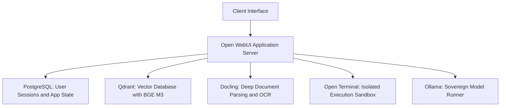
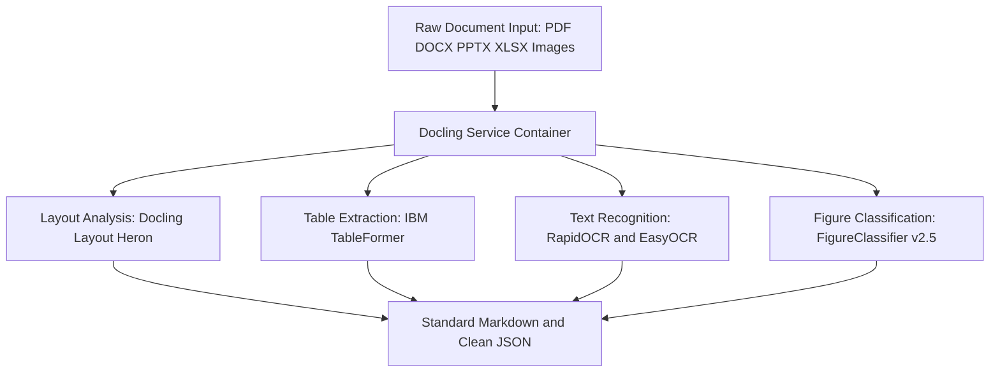
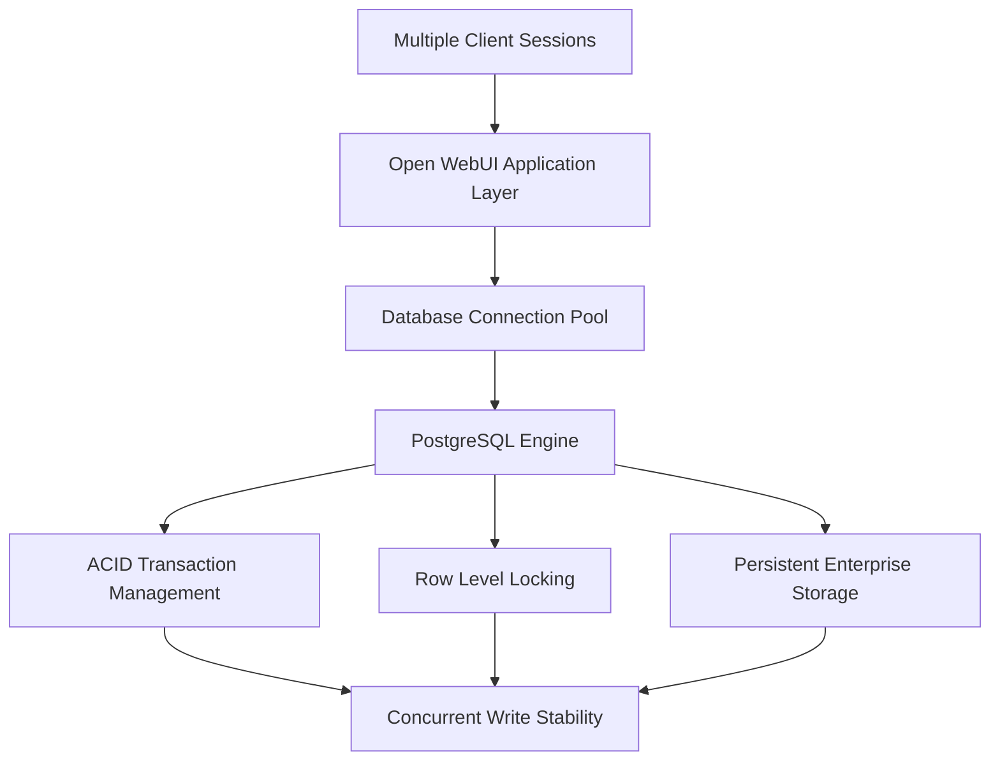
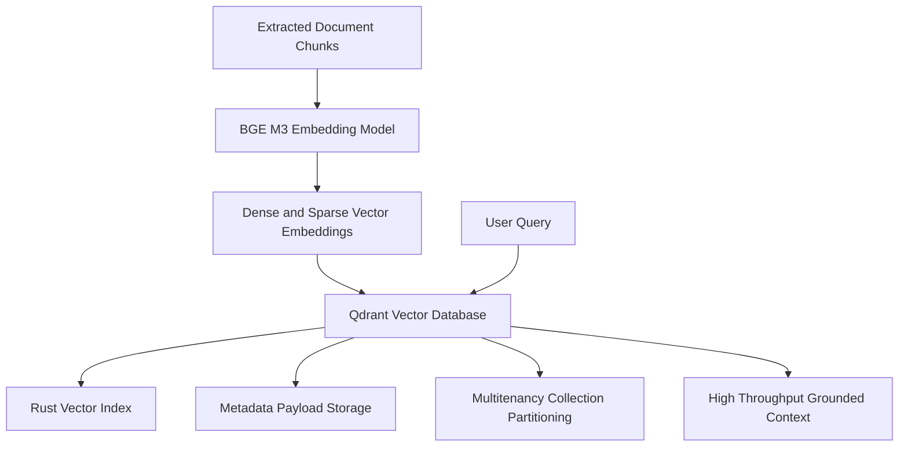
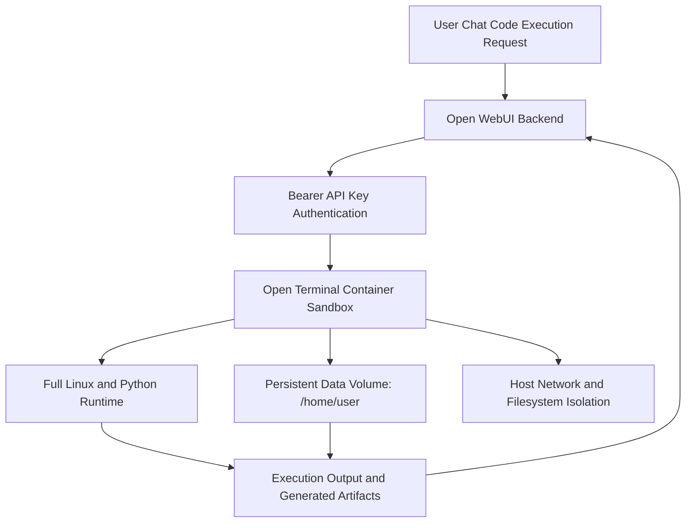
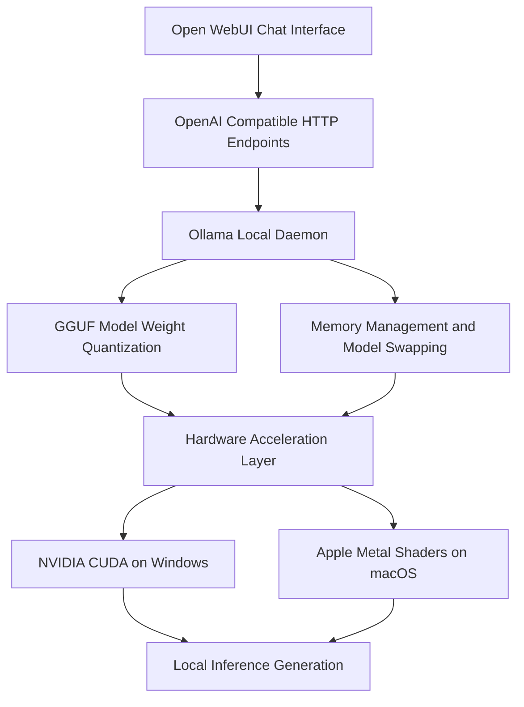

# Technology Selection Rationale

This document outlines the technical justification for the selected architecture components.
The system operates on premise with zero cloud dependencies.
The core infrastructure comprises Docling PostgreSQL Qdrant Open Terminal and Ollama.

## 1. Docling Document Processing Engine

Docling serves as the document extraction service.
Standard extraction libraries parse raw text strings but fail to retain structural relationships.
Docling applies neural models to identify document structures.
It performs optical character recognition and extracts tabular data from complex layouts.
It operates as an independent microservice within a container.
This architecture isolates compute tasks and guarantees that document parsing requires no external network access.

### Docling Model Architecture

| Task or Stage                       | Model or Engine                             | Path and Details                                                                                                                                        |
| :---------------------------------- | :------------------------------------------ | :------------------------------------------------------------------------------------------------------------------------------------------------------ |
| Document Layout Analysis            | Docling Layout Heron (docling-layout-heron) | Pre-packaged PyTorch and ONNX weights (model.safetensors and model.onnx). It detects titles and paragraphs and tables and images and reading order.     |
| Table Structure Extraction          | IBM TableFormer (tableformer)               | Contains both accurate and fast modes. It reconstructs complex tables and headers and spanning cells.                                                   |
| Figure Classification               | DocumentFigureClassifier-v2.5               | Classifies figures and schematics and graphs and diagrams and photos.                                                                                   |
| OCR (Optical Character Recognition) | RapidOCR (Active Default on GPU or ONNX)    | Text Detector: PP-OCRv6_det_small.onnx. Text Recognizer: PP-OCRv6_rec_small.onnx. Angle Classifier: ch_ppocr_mobile_v2.0_cls_mobile.onnx.               |
| OCR Fallbacks                       | EasyOCR and Tesseract                       | EasyOCR uses CRAFT text detector (craft_mlt_25k.pth) plus english_g2 and latin_g2 models. Tesseract uses system data at /usr/share/tesseract/tessdata/. |

### Supported Document Formats

| Format     | Extensions           | Notes                        |
| :--------- | :------------------- | :--------------------------- |
| PDF        | .pdf                 | Full OCR and layout analysis |
| Word       | .docx                | Structure preserved          |
| PowerPoint | .pptx                | Slide by slide extraction    |
| Excel      | .xlsx                | Table extraction             |
| Images     | .png .jpg .tiff .bmp | Pure OCR                     |
| HTML       | .html                | Structure preserved          |
| Markdown   | .md                  | Pass through                 |
| AsciiDoc   | .adoc                | Structure preserved          |

## 2. PostgreSQL Relational Database

PostgreSQL replaces the default SQLite database engine.
SQLite locks the entire database file during write operations.
This file locking mechanism introduces bottlenecks when concurrent users submit prompts and store sessions.
Concurrent writes in SQLite can also cause database corruption under heavy load.
PostgreSQL provides complete ACID compliance and row level locking.
It handles concurrent read and write transactions efficiently.
It supports enterprise connection pooling and automated backup routines.
It also enables secure multi-user role management for enterprise deployments.

## 3. Qdrant Vector Database

Qdrant serves as the vector database for knowledge retrieval.
The system configures Qdrant with the BGE M3 embedding model.
BGE M3 supports dense retrieval and sparse retrieval and multi-vector representations.
Qdrant executes similarity searches using vector indices written in Rust.
It outperforms ChromaDB in speed and memory efficiency.
ChromaDB runs in process or as an embedded service with SQLite storage.
That architecture suffers from memory bloat and index degradation as vector collections grow.
ChromaDB also lacks native payload indexing.
Qdrant stores payload metadata directly alongside vector points.
This design allows filtering by metadata without secondary index lookups.
Qdrant also provides native multitenancy isolation through payload partitioning.
Other vector databases supported by Open-WebUI include Milvus and Elasticsearch and Pgvector.
Milvus and Elasticsearch require extensive distributed infrastructure and substantial memory overhead.
Pgvector combines vector data inside relational tables but degrades in query throughput at scale.
Qdrant operates as a standalone engine with minimal resource utilization and dedicated gRPC endpoints.

## 4. Open Terminal Containerized Sandbox

Open Terminal provides an isolated execution environment for code interpretation.
The default execution engine in Open-WebUI is Pyodide.
Pyodide executes code strictly inside the web browser through WebAssembly.
This implementation cannot access the host filesystem.
It cannot execute system binaries.
It cannot run full Python packages that require native C or C++ extensions.
It also faces strict memory restrictions enforced by browser processes.
Direct execution on the host machine presents security risks.
Arbitrary script execution on the host OS can overwrite critical files or alter system settings.
Open Terminal resolves these limitations through isolated Docker containers.
It mounts a dedicated persistent volume at /home/user.
It executes scripts using a full Linux runtime.
Users can install standard Python libraries and run shell commands without risk to the host.
Authentication tokens secure every request to the container API.
The container restricts access to the host network.

## 5. Ollama Local Model Runner

Ollama provides local execution of open weight language models.
Alternative solutions include vLLM and llama.cpp server and LocalAI.
vLLM requires complex compilation steps and provides limited support on Windows environments.
Ollama packages model runtime components into a single executable.
It manages model weight quantization automatically using the GGUF format.
It supports hardware acceleration on Windows through NVIDIA CUDA.
It supports hardware acceleration on macOS through Apple Metal shaders.
It exposes standard OpenAI compatible HTTP endpoints.
It manages memory allocation and swaps inactive models automatically.
It operates entirely offline with zero telemetry and zero external network transmissions.

